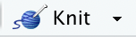

**Due:** Friday, September 2, 12:00pm (noon) on Canvas

**Instructions:** 

The goal of this assignment is refresh your computing with R. It covers R Markdown, packages, data, and some exploratory data analysis. If you're comfortable with R Markdown and you already have the `tidyverse` package installed, you can skip to the "Data" section below.

By the end of this lab, you will be able to

* Open, edit, and knit an R Markdown document
* Manipulate data frames in R
* Summarize and plot data

# R Markdown

R Markdown is a super versatile tool! Most of my lectures and assignments (including this page!) are actually built with R Markdown. `.Rmd` is the file extension for R Markdown documents.

R Markdown allows you to create data analysis documents which combine text, code, and figures. R Markdown will be our primary tool for writing up labs, homework assignments, and projects.

## Download the lab R Markdown template

For this lab, I have provided a template R Markdown document (`lab_01_template.Rmd`) for you to fill in:

**Step 1:** Download the Lab 1 template file: [lab_01_template.Rmd](https://sta214-f22.github.io/labs/lab_01_template.Rmd). Save it somewhere on your computer that you can find it easily (e.g., a folder on your desktop).

**Step 2:** Rename the file to `lab_01_your_name.Rmd` (so, for example, I would call it `lab_01_ciaran_evans.Rmd`).

**Step 3:** Open `lab_01_your_name.Rmd` in RStudio.

**Step 4:** Click the `knit` button  at the top of the document. The knitted document is an HTML file that you can share (when you are finished with the lab, you will submit an HTML file on Canvas). You will re-knit your R Markdown file as you complete the lab.

## Components of an R Markdown document

### The YAML
At the very top the document, there is a section bordered by `---`. This is called the YAML, and it contains information about how to display our document. 

**Step 5:** In the YAML, change `author` from `Your Name` to your actual name (keep the quotes). For example, I would do
```
author: "Ciaran Evans"
```
Now knit the document again; your name is now displayed at the top.

### Code chunks

R Markdown is great because we can include code directly in the document. This makes it *reproducible*, because the file contains all the code we used for a data analysis. We include R code in special blocks called *chunks*. These look like


In this lab, you will use one chunk for each question. You can see that I have included them for you in the template. You will fill them in as you go through the lab.

There is also a chunk at the beginning that we call the *setup* chunk. This is where we will do things like import data and load packages. For this lab, you will need the `tidyverse` package, so it has been included in the setup.

**Step 6:** Click the `Run` button  on the right of the setup chunk. The `Run` button runs code so you can experiment with data before knitting the R Markdown document.

### Text

Text you write outside of code chunks is displayed normally in the knitted HTML document. For example, `Type your answer to question 1 here...` is displayed under Exercise 1.

The `##` is used to denote a *header*. For example, `## Exercise 1` is displayed as

after you knit. The number of `#` controls how big the header is (more `#` --> smaller).

You're now ready to start working with the data! 

# Installing packages

In this class, we will often use the `ggplot2` and `dplyr` packages to visualize and manipulate data. These packages are part of the Tidyverse, a collection of R packages with a common philosophy on how to work with data. To complete this lab, you will need to install the `tidyverse` package (you can skip this step if you already have `tidyverse` installed).

In the console (not your R Markdown document), run the following code:

```r
install.packages("tidyverse")
library(tidyverse)
```

If that runs smoothly (it may take a couple minutes), you're all set! Otherwise, let me know if you run into issues.

# Data

Today we will be working with data on admission to graduate school. We have data on undergraduate students and the outcome of their application to graduate school. The variables are

* *admit*: whether or not the student was admitted (0 = no, 1 = yes)
* *gre*: the student's score on the GRE (graduate record exam)
* *GPA*: the student's grade point average
* *rank*: how prestigious the student's undergraduate institution is (1 = most prestigious, 2, 3, 4 = least prestigious)

## Loading the data

The data are available from the UCLA, and can be loaded into R with the following command:

```r
grad_app <- read.csv("https://stats.idre.ucla.edu/stat/data/binary.csv")
```

Here `read.csv` is a function that imports data from a CSV file. We can pass `read.csv` either a local path on our computer, or a URL -- in this case, we use the URL where the data is stored online. We have called the data `grad_app` in R.

Copy the command to load the data into the setup chunk of your R Markdown file, and run it.

# Exploratory data analysis (EDA)

## Getting familiar with the data

Let's start by looking at some basic features of the data. The `glimpse()` function shows the dimensions of the data and gives you a glimpse of the different columns.

:::{.question}
#### Question 1

In the code chunk for Question 1 in your R Markdown document, type the following code:
```r
glimpse(grad_app)
```
How many students are in the data?

:::

Next, we want to check if there are any missing values in the data. Missing data is usually represented by `NA` in R (which stands for "Not Available"). We can remove NAs from our data with the function `drop_na()`. Run the following code:

```r
grad_app_no_na <- grad_app %>%
  drop_na()
```

(The `%>%` is called the *pipe* operator. It just means "take THIS, then do THAT". So in the code above, we take `grad_app`, then `drop_na`. We save the result as a new data frame called `grad_app_no_na`).

:::{.question}
#### Question 2

Using the `glimpse` function from Question 1, how many students are in the `grad_app_no_na` data? Were there any missing values in the original data?

:::

The data contains students from undergraduate institutions with different prestige. What if we want to look only at undergraduates from the most prestigious institutions? The `filter` function allows us to select rows of a data which satisfy certain values.

:::{.question}
#### Question 3

Fill in the `...` in the following code to create a new data frame called `grad_app_prestigious`, which contains only students from the most prestigious schools.

```r
... <- grad_app %>%
  filter(rank == ...)
```

How many students in the data attended the most prestigious schools?
:::

*(Note that we have again used the `%>%`. Here we take `grad_app`, and then we filter by rank. The `==` in the filter is important: we use a double equals (`==`) for logical statements.)*

## Univariate EDA

Let's now look at some of the variables in our data. We'll begin with our outcome of interest: whether a student was admitted to graduate school.

:::{.question}
#### Question 4

We can visualize grad school acceptance with a *bar chart*. Run the following code to make the bar chart:

```r
grad_app %>%
  ggplot(aes(x = admit)) +
  geom_bar() +
  labs(x = "Accepted to grad school?",
       title = "Bar chart of grad school acceptance") +
  theme_bw()
```
:::

*What's going on here? `ggplot` builds plots layer by layer; the `+` means "add another layer". We start with an initial layer that specifies the aesthetics (`aes`) -- these tell us which variables to plot. We then add a geometry layer (`geom`) that tells us how to plot the variables -- in this case, `geom_bar` means "make a bar chart". Finally, we make the plot nice by adding labels and changing the background theme.*

:::{.question}
#### Question 5

Now let's look at the distribution of GPA in the data. Since GPA is quantitative, we will use a histogram. Fill in the `...` in the code to create the plot and change the x-axis label and title. Then use the histogram to describe the distribution of GPA.

```r
grad_app %>%
  ggplot(aes(x = ...)) +
  geom_...() +
  labs(x = "...",
       title = "...") +
  theme_bw()
```
:::

When we describe a quantitative variable, we often want to provide summary statistics. For example, the code below calculates the median and IQR for GPA (the `summarize` function is used to calculate summary statistics):

```r
grad_app %>%
  summarize(median_gpa = median(gpa),
            iqr_gpa = IQR(gpa))
```

:::{.question}
#### Question 6

Modify the code above to calculate the mean and standard deviation of GPA. *Hint: if you're not sure which function calculates the standard deviation, google usually gives helpful answers. Try googling "calculate standard deviation R" and see what you get.*
:::

## Bivariate EDA

What if we want to look the relationship between GPA and grad school acceptance? One way is with side-by-side boxplots. To create side-by-side boxplots, however, we need `admit` to be a categorical variable. Do we have that?

We can check the class of a variable with `class`. Run the following:

```r
class(grad_app$admit)
```

:::{.question}
#### Question 7

What type of variable does R think `admit` is?
:::

By default, when R sees numbers, it treats the variable as a numeric variable. However, we want to treat `admit` as a categorical variable, not a number. This means we need to change R's perception of this variable from a numeric variable into a categorical. To do this, we use `as.factor`:

```r
grad_app <- grad_app %>%
  mutate(admit = as.factor(admit))
```
*(The `mutate` function is a way of modifying columns or creating new columns. Here we using `mutate` to make `admit` a factor).*

Now check the class of `admit` -- "factor" means a categorical variable, so we're all set!

:::{.question}
#### Question 8

Fill in the following code to make side-by-side boxplots of GPA for students admitted and not admitted to graduate school. Give the graph nice axis labels and a title.

```r
grad_app %>%
  ggplot(aes(x = ..., y = ...)) +
  geom_...() +
  labs(x = "...",
       y = "...",
       title = "...") +
  theme_bw()
```
:::

We can also calculate summary statistics for each group (admitted and not admitted). The `group_by` function is a useful way to do this:

```r
grad_app %>%
  group_by(admit) %>%
  summarize(median_gre = median(gre),
            iqr_gre = IQR(gre))
```

This code calculates the median and IQR of GRE scores for each group.

:::{.question}
#### Question 9

Modify the code above to calculate the mean and standard deviation of GPA for each group.
:::

:::{.question}
#### Question 10

Using your answers to questions 8 and 9, what would you conclude about the relationship between GPA and acceptance to graduate school?
:::

Finally, let's look at the relationship between school rank and acceptance to graduate school. Since `rank` and `admit` are both categorical variables, we can make a two-way table. Run the following code:

```r
table(grad_app$rank, grad_app$admit)
```

:::{.question}
#### Question 11

What is the probability of acceptance for an undergraduate at a school ranked "most prestigious"? What are the odds of acceptance for an undergraduate at a school ranked "most prestigious"?
:::